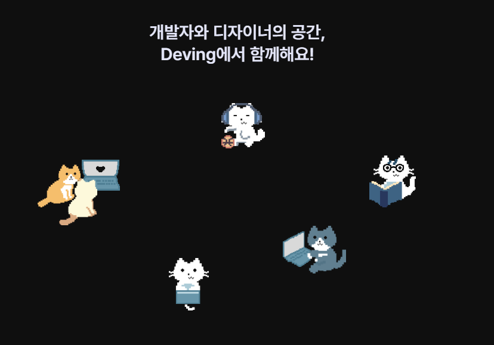
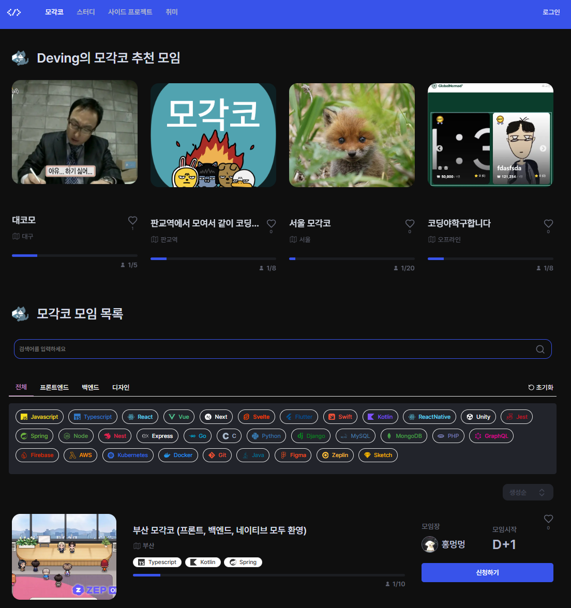
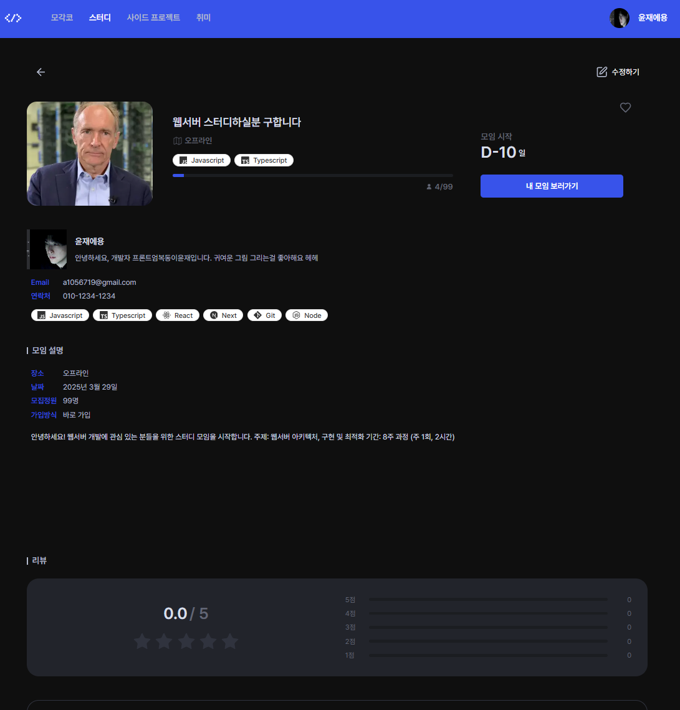
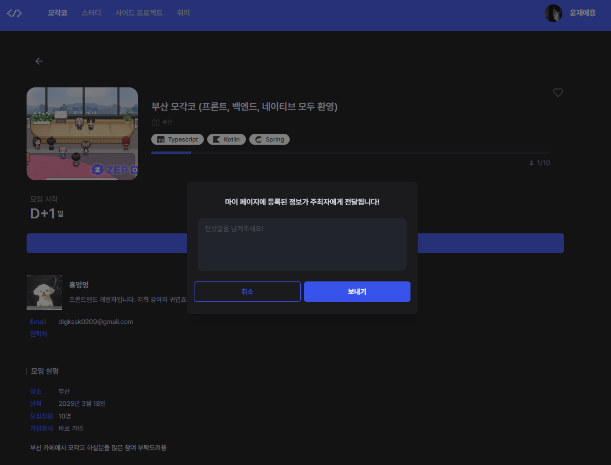
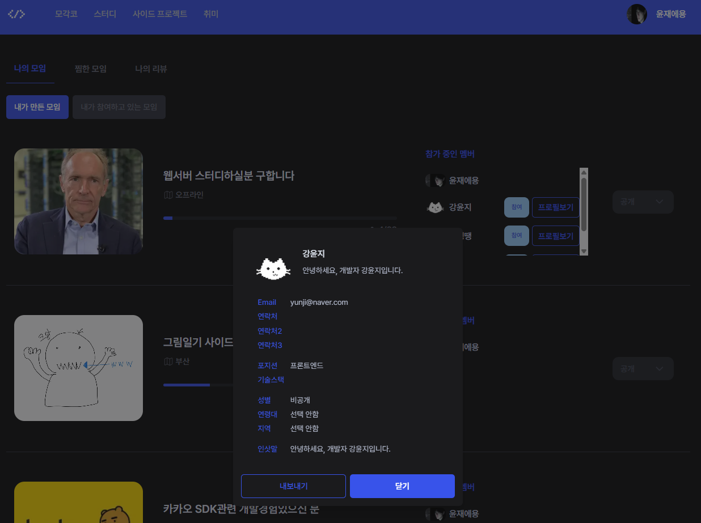
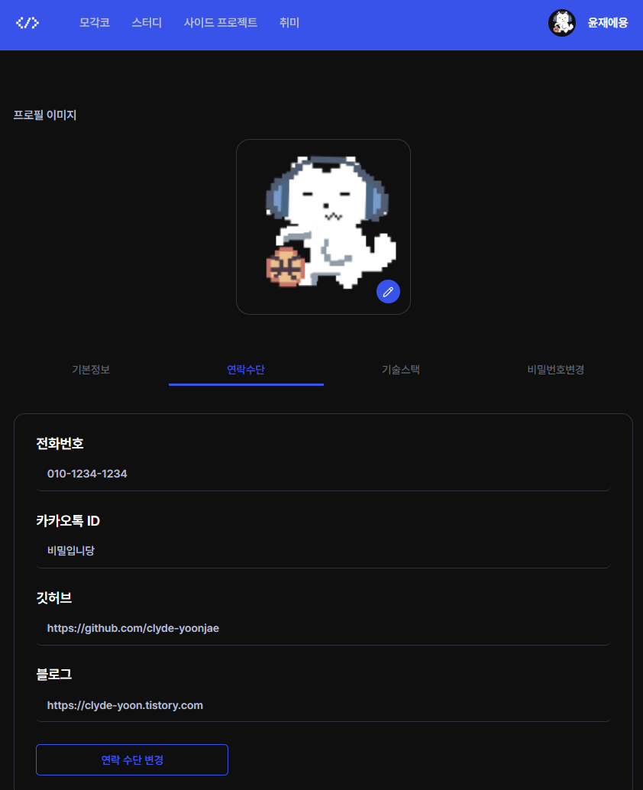

 

# 목차

## 1. [프로젝트 소개](#-프로젝트-소개)
## 2. [팀원 소개](#-팀원-소개)
## 3. [프로젝트 기획](#-프로젝트-기획)
## 4. [기간 및 협업관리](#️-기간-및-협업관리)
## 5. [기술스택](#-기술스택)
## 6. [주요 기능](#-주요-기능)

 

# 📚 프로젝트 소개

DEVING은 개발자와 디자이너를 위한 전문 모임 플랫폼입니다. 사이드 프로젝트, 모각코, 스터디, 취미 등 개발자 및 디자이너 직군들이 자주 이용하는 주제로 모임을 생성하고 참여할 수 있습니다. 함께 성장하고 네트워킹할 수 있는 커뮤니티를 제공합니다.

 

# 🧑‍💻 FE 팀원 소개

| 강윤지- Leader | 이윤재 | 이한나 | 이동석 |
|:-----:|:-----:|:-----:|:-----:|
|  |  |  |  |
| [:octocat: GitHub](https://github.com/dbswl701) | [:octocat: GitHub](https://github.com/clyde-yoonjae) | [:octocat: GitHub](https://github.com/lee1nna) | [:octocat: GitHub](https://github.com/Lee-Dong-Seok) |

 

# 💡 프로젝트 기획

### 기획의도

코드잇 스프린트 심화 단기과정에서 주어진 '모임 관련 서비스 개발' 과업을 수행하면서, 저희 팀은 개발자와 디자이너 커뮤니티에 주목했습니다. IT 업계에서 소통과 협업의 중요성을 인식하여, 개발자와 디자이너들이 쉽게 만나고 교류할 수 있는 플랫폼을 구축하고자 했습니다.

### 핵심 아이디어

- 기술 스택 필터링: 사용자가 관심 있는 기술 스택을 기반으로 모임을 검색할 수 있습니다.

- 맞춤형 프로필: 개인 프로필에 기술 스택, 경력, 관심사 등을 설정하여 자신을 표현할 수 있습니다.

- 직관적인 UX/UI: 사용자 경험을 최우선으로 고려한 인터페이스 설계로 누구나 쉽게 이용할 수 있습니다.

 

# 🖥️ 기간 및 협업관리

 

### [ 기간 ]

<table style="font-size: 20px;">
 <tr>
   <th>구분</th>
   <th> 날짜</th>
 </tr>
 <tr>
   <td>기획 기간</td>
   <td>2025.01.24 ~ 02.10</td>
 </tr>
 <tr>
   <td>개발 기간</td>
   <td>2025.02.11 ~ 03.14</td>
 </tr>
</table>

 

### [ 협업 관리 ]

| 협업 도구      | 활용 내용                                                                               |
| -------------- | --------------------------------------------------------------------------------------- |
| 📝 **Notion**  | • 데일리 스크럼 기록 • 트러블슈팅 문서화 • 기술 Wiki 구축 • 프로젝트 정보 공유 |
| 🎙️ **Discord** | • 실시간 화상 회의 • 팀 커뮤니케이션                                                 |
| 📊 **Jira**    | • 브랜치 관리 • 스프린트 계획 및 추적 • 작업 할당 및 진행상황 모니터링            |
| 📌 **GitHub**  | • 코드 버전 관리 • PR 및 코드 리뷰 • 이슈 트래킹                                  |

 

# 🔧 기술스택

###  Next.js (App Router)

Next.js의 App Router를 활용하여 서버 컴포넌트 기반의 아키텍처를 구현했습니다. 이를 통해 다음과 같은 이점을 얻을 수 있었습니다:

- **서버 사이드 렌더링(SSR)**: 초기 로딩 속도 향상 및 SEO 최적화
- **서버 컴포넌트**: 클라이언트에 JavaScript 번들을 전송하지 않고 서버에서 렌더링하여 성능 개선
- **데이터 프리페칭**: 페이지 렌더링 전에 필요한 데이터를 미리 로드하여 사용자 경험 개선
- **서버 상태 기반 인증**: 보안성이 향상된 사용자 인증 시스템 구현

###  TanStack Query

서버 상태 관리를 위해 TanStack Query(React Query)를 사용했습니다:
- **효율적인 데이터 페칭**: 자동 캐싱, 백그라운드 업데이트, 재시도 로직 구현
- **서버 상태와 클라이언트 상태 분리**: 상태 관리 로직 단순화
- **데이터 동기화**: 최신 데이터를 항상 유지하면서도 불필요한 네트워크 요청 최소화
- **쿼리키 팩토리패턴**: 프로젝트 내 전략적인 쿼리키 관리
- **무한 스크롤**: 대용량 데이터 효율적 처리

###  shadcn/ui &  MUI

디자인 시안 확정 전 신속한 개발 환경 구축을 위해 두 UI 라이브러리를 전략적으로 활용했습니다:
- **프로토타이핑 가속화**: 고품질 컴포넌트로 빠른 MVP 개발
- **일관된 디자인 시스템**: 프로젝트 초기 단계에서 디자인 일관성 유지
- **사용자 경험 향상**: 검증된 UI 패턴 적용으로 직관적인 인터페이스 구현
- **개발 효율성**: 컴포넌트 재사용으로 개발 시간 단축

 

# ✨ 주요 기능

| 모임 찾기 | 모임 상세보기 |
|:---:|:---:|
| 여러가지 필터를 통해 모임을 쉽고 빠르게 찾을 수 있습니다. | 모임에 대한 상세 정보를 한눈에 확인할 수 있습니다. |
|  |  |

| 모임 신청 | 모임 관리 및 멤버관리 |
|:---:|:---:|
| 간편한 절차를 통해 모임에 참여 신청을 할 수 있습니다. | 주최모임과 참여자들을 관리 및 상태를 변경 할 수 있습니다. |
|  |  |

| 내 정보 수정 | |
|:---:|:---:|
| 프로필 정보를 간편하게 수정할 수 있습니다. | |
|  | |
 

## 🎈 프로젝트 산출물

| 문서 종류 | 링크 |
|:---|:---|
| 📝 **와이어 프레임** | [DEVING - 와이어 프레임](https://www.figma.com/files/team/1239829768059524989/recents-and-sharing?fuid=1239829763104263861) |
| 🎨 **디자인 시안** | [DEVING - 디자인 시안](https://www.figma.com/design/whAR7r8MPfWo9Cl93zhKlL/DEVING-%EC%8B%9C%EC%95%88?node-id=0-1&p=f&t=hQ9Sr369FbrTyGqY-0) |
| 📘 **API 문서** | [DEVING - 스웨거](https://deving.shop/swagger-ui/index.html#/auth-controller) |